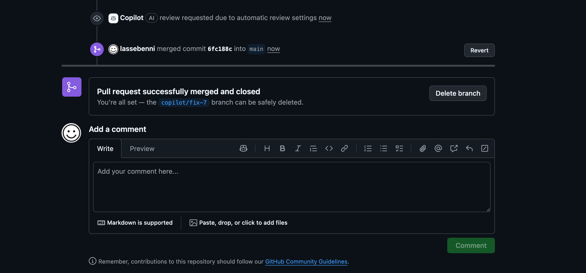

# Auto-Assign GitHub Issues to Copilot When Your CI Fails

**TLDR:** Set up a GitHub Actions workflow that automatically creates issues when builds fail and assigns them to GitHub Copilot for AI-powered fixes. I'll show you exactly how to do it in 6 steps.

You cloned a project, the CI is broken, and now you're manually creating GitHub issues to track the failures. Sound familiar?

There's a better way. You can automate the entire process: when your GitHub Actions fail, automatically create an issue and let Copilot fix it for you. In the best case, it immediately suggests the correct fix. In many cases, it will give you a starting point for the fix which you can iterate on. No more manual issue creation, no more forgotten build failures.

## Why This Actually Matters

**Before:** CI fails → You manually create an issue → It sits there → Someone eventually looks at it → Maybe gets fixed

**After:** CI fails → Issue created automatically → Copilot suggests a fix → Quick review → Merged → Done

The difference? Your build failures actually get addressed instead of becoming technical debt.

Here's how to set it up.

## What You'll Need

- A Github account. You can register one from [github.com](https://github.com).
- A GitHub repository, create one [here](https://github.com/new).
- Enable GitHub Copilot in your account. This allows Microsoft's AI to work on issues and create pull requests automatically.
- A GitHub Actions workflow. You can copy the code from [.github/workflows/copilot-create-issue.yml](.github/workflows/copilot-create-issue.yml)

## Prerequisites: Enable GitHub Copilot

Before we can assign issues to Copilot, you need to make sure GitHub Copilot is properly enabled and configured for your repository.

### Prerequisite 1. Enable GitHub Copilot

First, ensure you have GitHub Copilot enabled for your account. If you don't have access yet, you'll need to subscribe to GitHub Copilot in your account settings.

### Prerequisite 2. Enable the Coding Agent

Next, enable the GitHub Copilot coding agent feature. This allows Copilot to work on issues and create pull requests automatically.

### Prerequisite 3. Allow the Coding Agent access to the repository

Finally, make sure to allow the coding agent to work on your repositories. This permission is required for Copilot to create and update pull requests on your behalf. In this case, I chose to allow for select repositories to filter its access.

---

### Steps for setting up the Copilot Issue Automation

## Step 1: Create a Personal Access Token

Go to your GitHub **Developer Settings**. You need a fine-grained PAT because the workflow needs to create issues automatically.

Create a new **fine-grained Personal Access Token** with these permissions:
- **Read and Write access to Issues**
- **Read access to Repository**

*Note: You can't create fine-grained PATs via CLI. Has to be done in the UI.*

## Step 2: Watch the Magic Happen

Once your PAT is configured, the automation kicks in. Here's what happens when your build fails:

Your GitHub Actions workflow fails (happens to the best of us).

The `on: failure` trigger activates your issue creation workflow.

A new GitHub issue is automatically created with:
- Workflow name and run number
- Failure timestamp  
- Link to the failed run
- Error context

The issue appears in your Issues tab, ready for action.

## Step 3: Let Copilot Fix It

Now comes the fun part. Instead of manually debugging, you assign the issue to GitHub Copilot:

Copilot analyzes the failure and creates a pull request to fix it.

The AI examines your codebase and the specific failure context.

You can chat with Copilot about the issue to understand the problem better.

Copilot proposes specific code changes to resolve the workflow failure.

## Step 4: Review and Merge

The rest follows standard GitHub flow:

The pull request gets updated with Copilot's proposed fix.

You review the changes to make sure they look reasonable.

Mark the PR as ready for review.

Get approval from your team (or approve it yourself if you're feeling brave).

Merge the fix.

The original issue automatically closes. Done.

## Pro Tips

- **Don't skip the review step.** Copilot is smart, but it's not infallible.
- **Customize your issue templates** to include more context about failures.
- **Set up notifications** so you know when new auto-issues are created.
- **Use this for tests, not just builds.** Failed tests often have obvious fixes that Copilot can handle.

The best part? Once it's set up, you literally never think about it again. Your CI failures just... get fixed automatically.

*This works particularly well for common failure patterns: dependency updates, linting errors, simple test failures, and configuration issues. For complex bugs, you'll still need human intervention, but this handles the tedious stuff.*

## Who am I?

I'm Lasse Benninga, a Data & Analytics Engineer with 7+ years of experience building data platforms and automation pipelines across AWS, GCP, and Azure. I've worked with companies like KLM Royal Dutch Airlines, Vattenfall, and ANWB, where I've architected and implemented scalable data solutions using everything from managing cloud infrastructure with Terraform to building data warehouses with Snowflake and dbt.

I believe building robust CI/CD pipelines and automation solutions is essential for streamlining development, reducing debugging time, and saving costs for clients. This GitHub Actions workflow was born out of the need to automate issue tracking for build failures, ensuring problems are detected and addressed quickly with AI-powered suggestions.

You can find more of my work on [GitHub](https://github.com/lassebenni) or connect with me on [LinkedIn](https://www.linkedin.com/in/lasse-benninga-a462b194/).